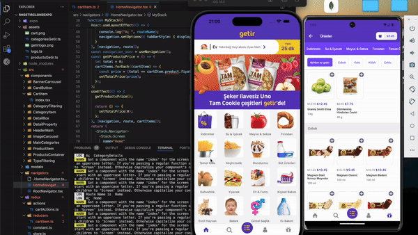

# 🚀 React Native Expo Getir Clone

Bu proje, TypeScript kullanılarak oluşturulmuş bir **React Native Expo**
uygulaması klonudur. Uygulama geliştirme sürecinde kullanılan kütüphaneler ve
işlevleri aşağıda listelenmiştir.

## Kullanılan Kütüphaneler ve İşlevleri

- **@react-native-masked-view/masked-view**: UI tasarımında görüntüleri
  maskelemek için kullanılır, yaratıcılığı artırır.
- **@react-navigation/bottom-tabs**: Alt sekmeler arasında gezinmeyi sağlar,
  kullanıcı deneyimini iyileştirir.
- **@react-navigation/native**: Navigasyon işlemleri için temel işlevsellik
  sağlar, ekran geçişlerini yönetir.
- **@react-navigation/stack**: Yığın tabanlı navigasyon sağlar, ekranlar arası
  geçişi kolaylaştırır.
- **expo**: Hızlı ve kolay geliştirme sağlayan temel araç setidir.
- **expo-status-bar**: Durum çubuğunu özelleştirmenizi sağlar.
- **logger**: Uygulama içinde günlükleme işlevi sunar, hata ayıklamayı
  kolaylaştırır.
- **react**: Uygulamanızın temel bileşenlerini oluşturan JavaScript
  kütüphanesidir.
- **react-native**: Mobil uygulama geliştirmek için gerekli bileşen ve API’leri
  sağlar.
- **react-native-gesture-handler**: Dokunma ve hareket etkileşimlerini yönetir.
- **react-native-safe-area-context**: Cihazların güvenli alanlarını tanımlar.
- **react-native-screens**: Ekran yönetimini optimize eder, geçişleri
  hızlandırır.
- **react-redux**: React ile Redux entegrasyonunu sağlar.
- **redux**: Uygulama durumunu merkezi bir store’da yönetir.
- **redux-devtools-extension**: Redux state'ini izlemek ve hata ayıklamak için
  kullanılır.
- **redux-thunk**: Asenkron işlemleri yönetmek için kullanılan middleware.

## Gereksinimler

- **Node.js** (v14 veya üstü)
- **Expo CLI**
- **Android Studio** veya **Xcode** (Android/iOS için)

## Uygulama Özeti

Bu proje, React Native Expo ile geliştirilen bir mobil uygulama klonudur.
Yukarıda listelenen kütüphaneler, projenin daha verimli ve kullanıcı dostu
olmasına katkıda bulunmuştur.

---

### Uygulama Görünümü (GIF)

---
